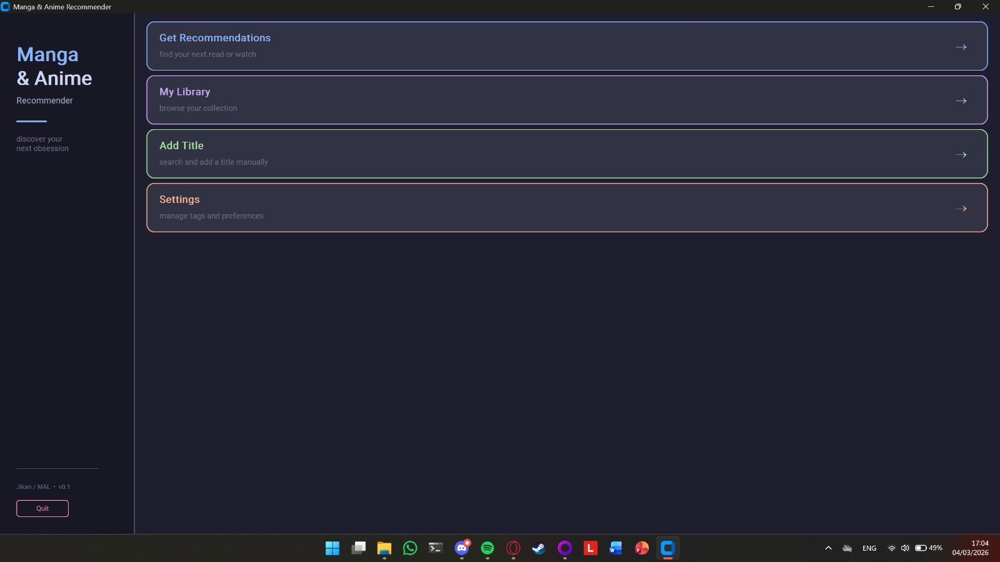
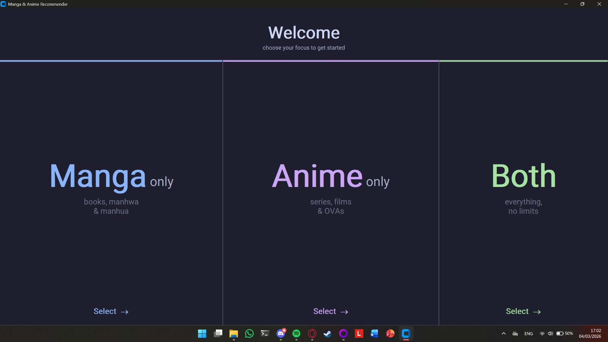
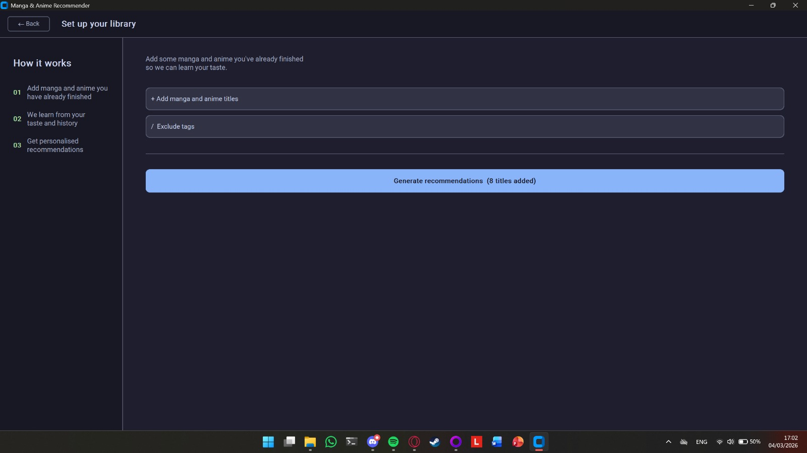
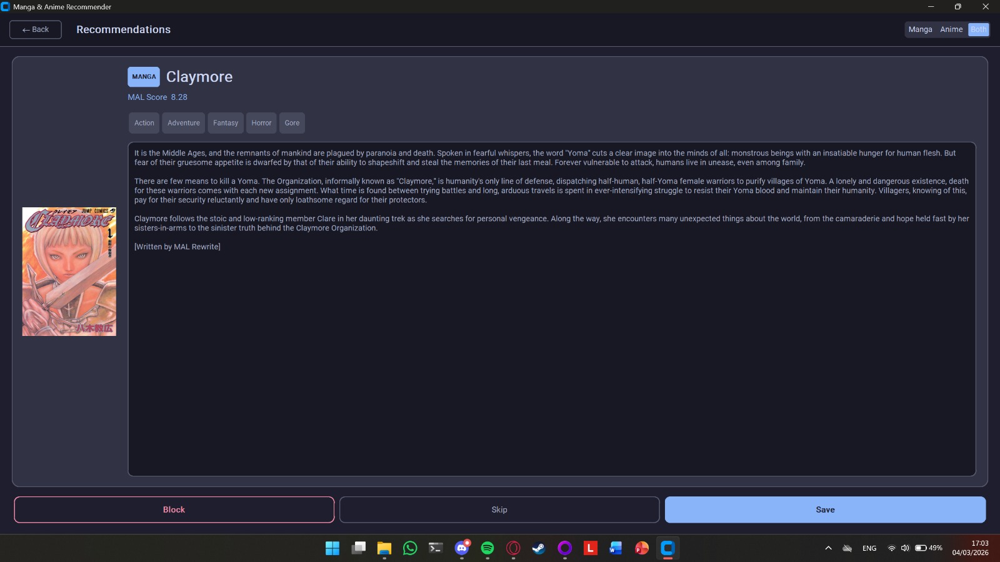
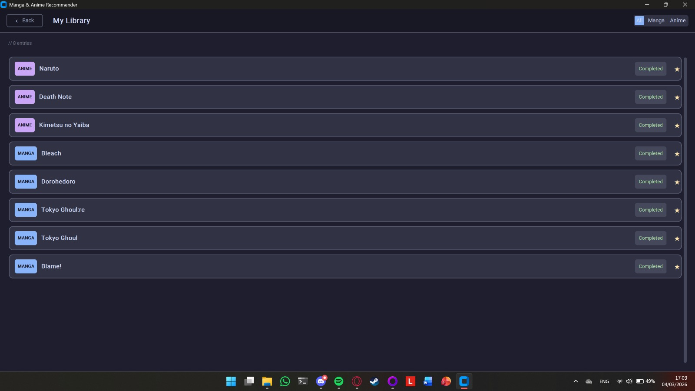

# Manga & Anime Recommender

A desktop application that recommends manga and anime based on your personal taste. Add titles you've already consumed, and the app learns your preferences to suggest what to read or watch next. Powered by [MyAnimeList](https://myanimelist.net/) data via the [Jikan API](https://jikan.moe/).

---

<!-- Screenshot: Home screen -->


---

## Features

- **Personalised recommendations** — scored by weighted tag overlap with your library
- **Manga and anime support** — track and get recommendations for both, independently
- **Swipeable recommendation cards** — save, skip, or block titles with one click
- **Personal library** — track status (completed, in progress, plan to read/watch)
- **Tag blacklist** — exclude genres you never want recommended (e.g. Ecchi, Gore)
- **Offline-friendly** — your library and recommendations are stored locally in SQLite
- **Cross-platform** — works on Windows, macOS, and Linux

---

## Screenshots

<!-- Screenshot: Onboarding -->



<!-- Screenshot: Recommendation card -->


<!-- Screenshot: Library view -->



---

## Installation

### Option 1 — Download the executable (recommended)

Go to the [Releases](../../releases) page and download the binary for your platform:

| Platform | File |
|----------|------|
| Windows  | `manga-recommender-windows.exe` |
| Linux    | `manga-recommender-linux` |
| macOS    | `manga-recommender-macos` |

**Windows:** double-click the `.exe` to run.

**Linux:**
```bash
chmod +x manga-recommender-linux
./manga-recommender-linux
```

**macOS:**
```bash
chmod +x manga-recommender-macos
./manga-recommender-macos
```

> **Note:** On first run, the app creates a `data/` folder in the same directory as the executable. This folder contains your personal library database (`manga.db`). Do not delete it — it stores all your library entries, recommendations, and settings. If you move the executable, move the `data/` folder with it.

---

### Option 2 — Run from source

**Requirements:** Python 3.12+, tkinter

```bash
# Clone the repo
git clone https://github.com/roman11x/manga-recommender.git
cd manga-recommender

# Create and activate a virtual environment
python3 -m venv .venv
source .venv/bin/activate        # Linux / macOS
.venv\Scripts\activate           # Windows

# Install dependencies
pip install -r requirements.txt

# Run
python main.py
```

**Linux users:** if the window fails to open, install tkinter first:
```bash
# Fedora
sudo dnf install python3-tkinter

# Ubuntu / Debian
sudo apt install python3-tk
```

---

## How it works

1. **Add titles** you have already finished and mark them as consumed + liked/disliked
2. The app builds a **tag weight profile** from your liked titles (genres + themes)
3. It fetches candidates from the Jikan API and **scores them** by tag overlap with your profile
4. Top-scoring titles appear as **recommendation cards** — save, skip, or block each one
5. Saved recommendations appear in **My Library** as your backlog
6. Add more consumed titles over time to improve future recommendations

---

## First run

On first launch you will see the onboarding screen. Choose whether you want manga, anime, or both, then add at least one title you have consumed and liked. Once you hit **Generate**, the app fetches recommendations and takes you to the home screen.

<!-- Screenshot: Generate button active -->


---

## Data & privacy

All data is stored locally in `data/manga.db` next to the executable. Nothing is sent to any server except read-only requests to the [Jikan API](https://jikan.moe/) (unofficial MyAnimeList API, no account required).

---

## Built with

- [Python 3.12](https://www.python.org/)
- [CustomTkinter](https://github.com/TomSchimansky/CustomTkinter) — GUI
- [Jikan API](https://jikan.moe/) — MyAnimeList data
- [Pillow](https://python-pillow.org/) — cover art
- [SQLite](https://www.sqlite.org/) — local storage
- [PyInstaller](https://pyinstaller.org/) — packaging

---

## License

MIT